# Assignment 1 - Task-2

## docker image from part1
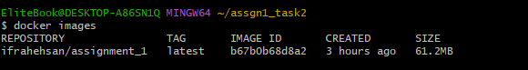

## run docker container
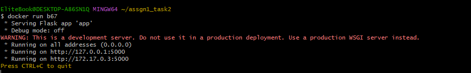

## different docker commands

- **docker ps :** list all running containers
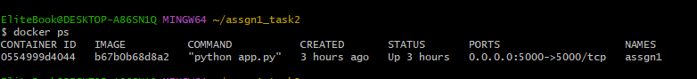

- **docker stop :** stop running container
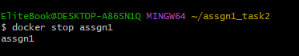

- **docker rm :** removed stop container
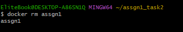

- **docker logs :** show container logs
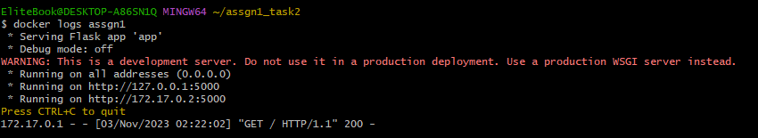

- **docker inspect :** view container details
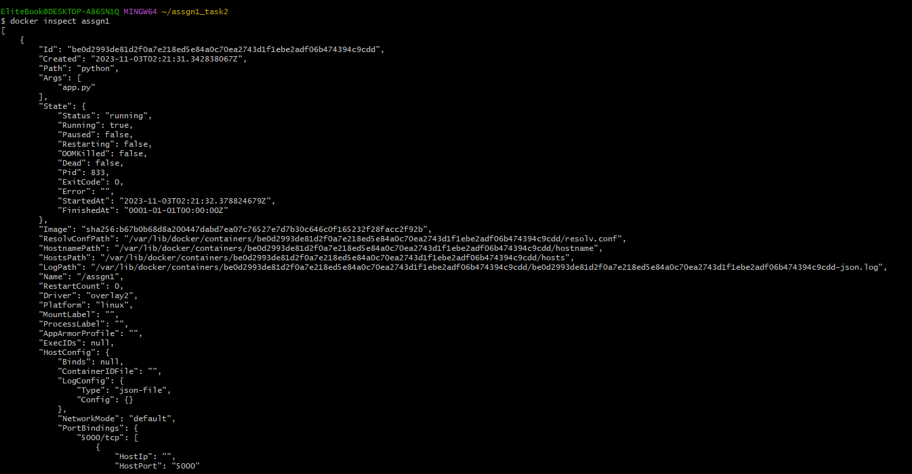
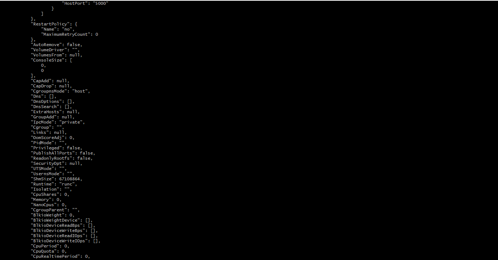
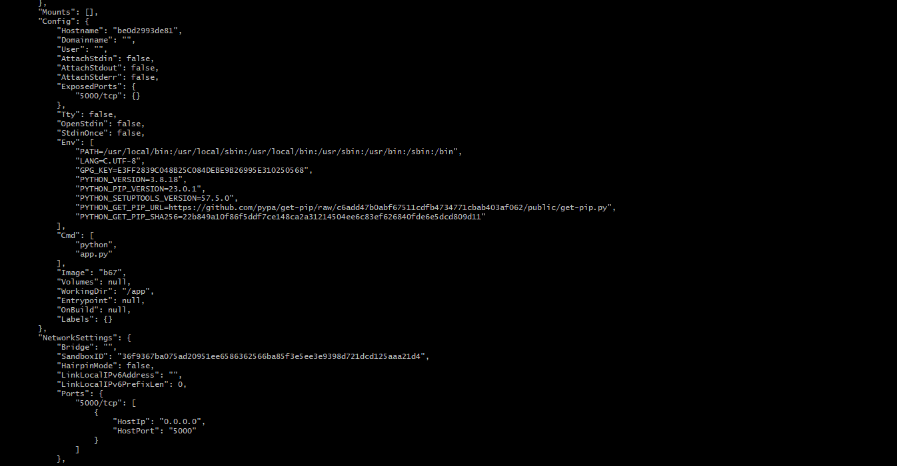
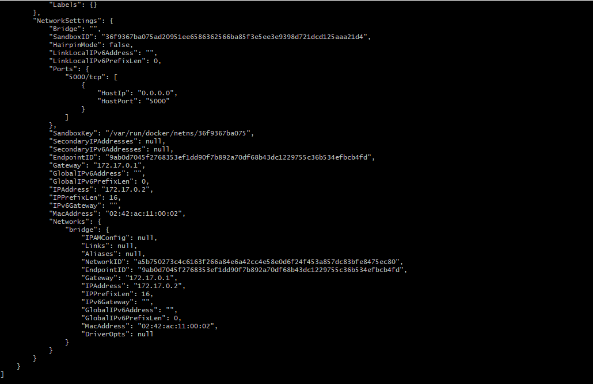

- **docker exec :** to execute command inside a running container
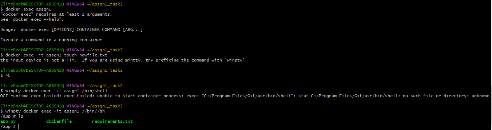

- **docker commit :** create new image with container changes
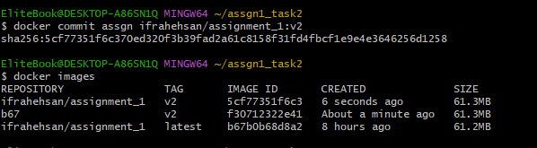

- **docker cp :** copy files or folders between container & local system
( ihave created new file by **touch** command i.e emptyfile.txt and copied it to container)

- **docker stats :** view resource usage of container
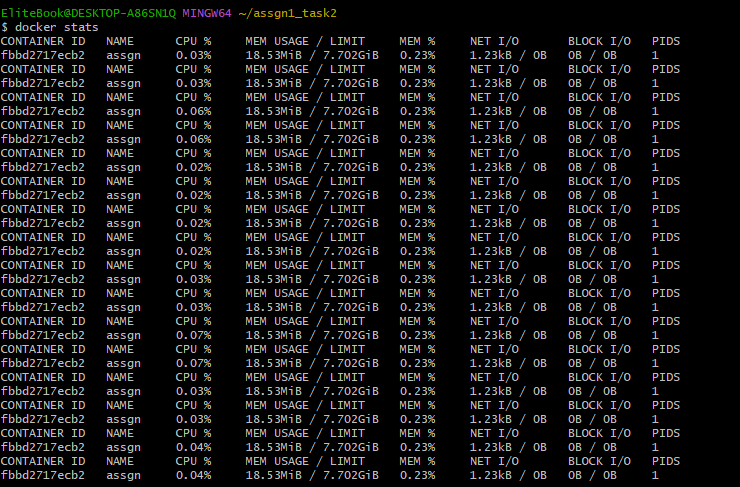

- **docker top :** display running process of container
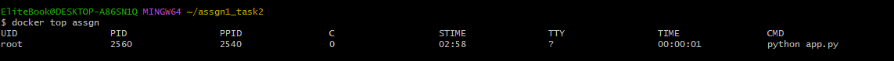

- **docker stop :** stop a container
**docker start :** start a stopped container
**docker pause :** pause a running container
**docker unpause :** unpause a paued container
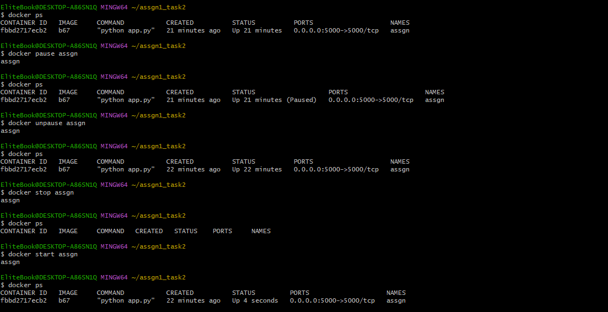

- **docker rename :** rename a container
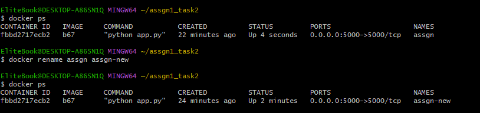

- **docker wait :** wait for a container to exit and then display its exit code
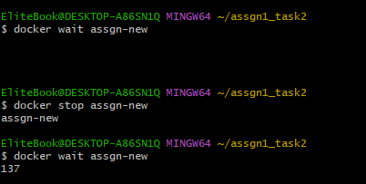

- **docker port :**  display the public-facing port that a container is listening on
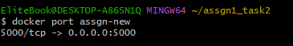

- **docker update :** update a container's resource limits
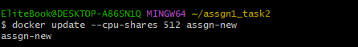

- **docker restart :** restart a running container
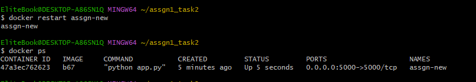

